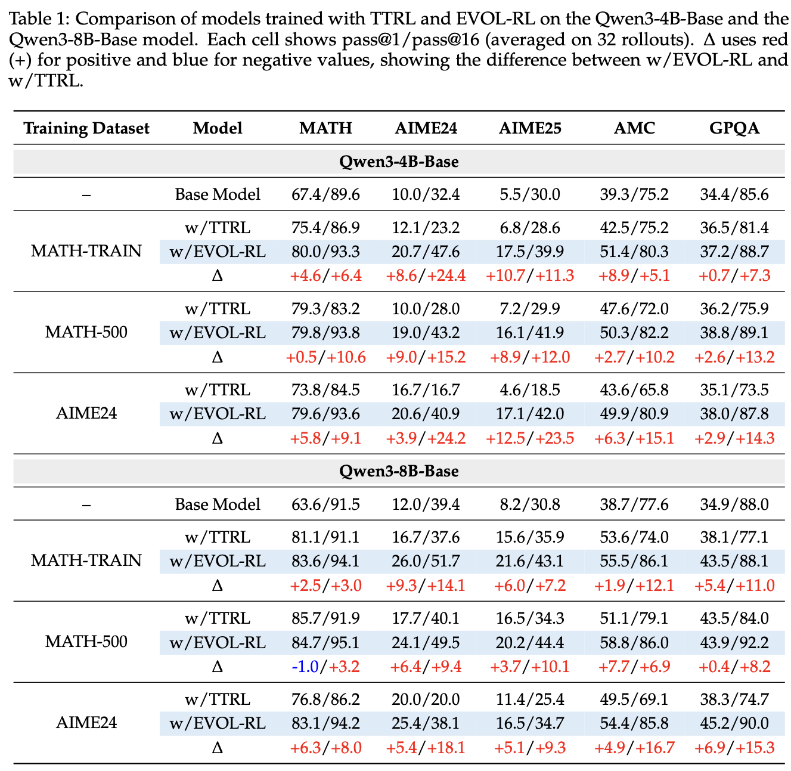

# 🧬 EVOL-RL: Evolutionary Reinforcement Learning

## 🧭 Overview

This repository contains the official implementation for EVOL-RL, a new framework enabling Large Language Models (LLMs) to self-improve on unlabeled data without performance degradation.


### 🧠 The Problem & Our Solution

Current label-free methods like Test-Time Reinforcement Learning (TTRL) suffer from a critical failure mode we identify as "Cognitive Collapse." Optimizing solely for self-consensus traps the model in a degenerative loop, causing a decline in solution diversity (pass@n), reasoning complexity, and out-of-domain generalization.

Inspired by biological evolution, EVOL-RL solves this by redesigning the learning objective to balance two fundamental forces:

- Selection (Stability): Retaining the majority-voted answer as a stabilizing signal.

- Variation (Exploration): Introducing a novelty-aware reward to incentivize semantically different reasoning paths.

This "majority-for-stability, novelty-for-exploration" design successfully averts cognitive collapse, fostering a healthy equilibrium between refining known solutions and discovering new ones.

### 📈 Key Results

Our experiments on Qwen3-4B-Base and Qwen3-8B-Base models show that EVOL-RL consistently outperforms consensus-only baselines. It prevents all symptoms of collapse and yields significant generalization gains. For instance, after training on AIME24, EVOL-RL boosts the Qwen3-4B-Base model's pass@1 accuracy on the unseen AIME25 benchmark from 4.6% (TTRL) to 16.4% and more than doubles its pass@16 accuracy from 18.5% to 37.9%.

This repository provides the necessary code to replicate our findings and apply the EVOL-RL framework to your own models.

More results can be found in the following figure and table:



## 📁 Project Structure

```
EVOL-RL/
└── verl/          # VERL framework implementation
    ├── examples/   # Example scripts and configurations
    ├── data/       # Datasets (AIME, MATH, GPQA, etc.)
    ├── docs/       # Documentation
    ├── tests/      # Test suites
    └── ...
```

## 🚀 Quickstart Guide

### 1. 📦 Installation

First, navigate to the verl directory and install the package:

```bash
cd verl
pip install -e .
pip install antlr4-python3-runtime==4.9.3
pip install numpy==1.26.4
```

### 2. 🎯 TTRL Baseline Training and Testing

For TTRL baseline, you can directly run training and testing on the MATH Training Set:

```bash
sh examples/labelfree/ttrl_baseline.sh --task math_train
```

This will train and test the TTRL baseline model on the MATH Training dataset.

### 3. 🧬 EVOL-RL Training and Testing

For EVOL-RL, you need to first deploy the vLLM embedding API service.

#### 3.1 🔧 Deploy vLLM Embedding API

Deploy the vLLM embedding service:

```bash
# Deploy in foreground (for testing)
# sh deploy_vllm_embedding.sh

# Deploy in background (for production)
sh deploy_vllm_embedding.sh start-daemon
```

**What the script does:**
- Check CUDA environment and GPU availability
- Install required dependencies (vLLM, FastAPI, etc.)
- Download the Qwen3-Embedding-4B model (~8GB)
- Start the vLLM embedding service on port 2341
- Set up proper environment variables

**Background deployment details:**
- Service runs in background with logs written to `vllm_service.log`
- Use `sh deploy_vllm_embedding.sh stop` to stop the service
- Use `sh deploy_vllm_embedding.sh show-commands` to see client commands
- Use `sh deploy_vllm_embedding.sh test` to test local service

#### 3.2 ✅ Verify API Deployment

Test if the API is working:

```bash
curl -X POST http://localhost:2341/embed \
  -H "Content-Type: application/json" \
  -d '{"texts": ["Hello world"]}'
```

#### 3.3 ⚙️ Configure API Address

**For local deployment:**
Edit the API address in `examples/labelfree/evol_rl.sh` at line 126:

```bash
# Local server (if running on same machine)
export VLLM_API_URL="http://localhost:2341"
```

**For remote deployment:**
```bash
# Remote server (replace with actual IP)
export VLLM_API_URL="http://192.168.1.100:2341"
```

**Verify configuration:**
```bash
# Test if the configured URL is accessible
curl $VLLM_API_URL/health

# Should return: {"status": "healthy", "model": "Qwen/Qwen3-Embedding-4B"}
```

#### 3.4 🏃 Run EVOL-RL Training

Run EVOL-RL training and testing:

```bash
sh examples/labelfree/evol_rl.sh --ent 0.003 --clip-high
```

### 4. 🧪 Standalone Testing

For standalone testing, you can use the batch evaluation script:

```bash
# Test predefined datasets
sh test_three_datasets.sh --batch_mode --set 1

# Test a specific model and dataset
sh test_three_datasets.sh --model_path /path/to/model --datasets AIME-TTT
```

## 📊 Available Datasets

- **AIME-TTT**: AIME 2024 problems
- **MATH-TTT**: MATH500 problems  
- **AIME25**: AIME 2025 problems
- **AMC-TTT**: AMC competition problems
- **GPQA-TTT**: GPQA-Diamond problems

## 🎯 Available Training Tasks

- **AIME-TTT**: AIME24 competition problems training
- **MATH-TTT**: MATH dataset problems training
- **math_train**: MATH training set 

## 🤖 Model Support

- **Qwen3-4B-Base**: 4B parameter model
- **Qwen3-8B-Base**: 8B parameter model
